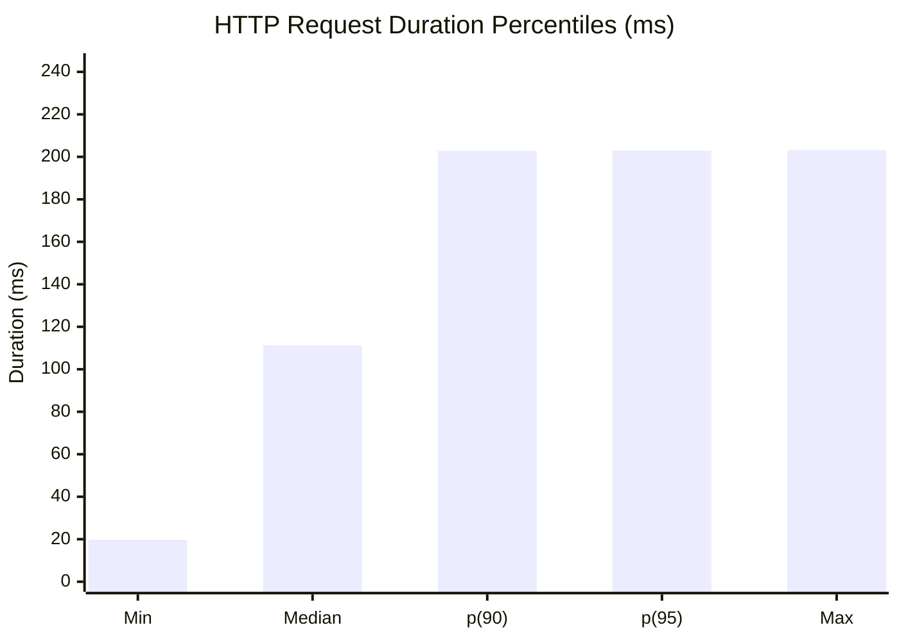

# 🚀 k6 Load Test Report - Profile: `FULL`

> **Run Timestamp:** `2026-09-13T20:35:05.988Z`  
> **Target Environment:** `https://test.k6.io`

---

## 📊 Summary Overview

| Metric | Value |
| :--- | :--- |
| **Profile** | `full` |
| **Max VUs** | **1** |
| **Total HTTP Requests** | **4** (1.39 req/s) |
| **HTTP Error Rate** | **0.00%** |
| **Checks Passed** | **4** |
| **Checks Failed** | **0** |

---

## 📈 Latency Distribution (ms)

| Avg | Min | Median | p(90) | p(95) | Max |
| :---: | :---: | :---: | :---: | :---: | :---: |
| `111.36 ms` | `19.76 ms` | `111.26 ms` | `202.84 ms` | `203.00 ms` | `203.16 ms` |

### Latency Percentiles Chart

---

## 🎯 Checks & Assertions

- ✅ **status is 200**: 2 passed, 0 failed
- ✅ **body contains QuickPizza**: 2 passed, 0 failed

---

## 📋 Confluence / Wiki Note
This markdown document can be:
1. Rendered directly in **GitHub / GitLab / Bitbucket / Azure DevOps PRs or Wikis** (Mermaid charts render natively).
2. Imported into **Confluence** via **Insert > Markdown** or using Atlassian's Mermaid macro / Confluence REST API automation.
